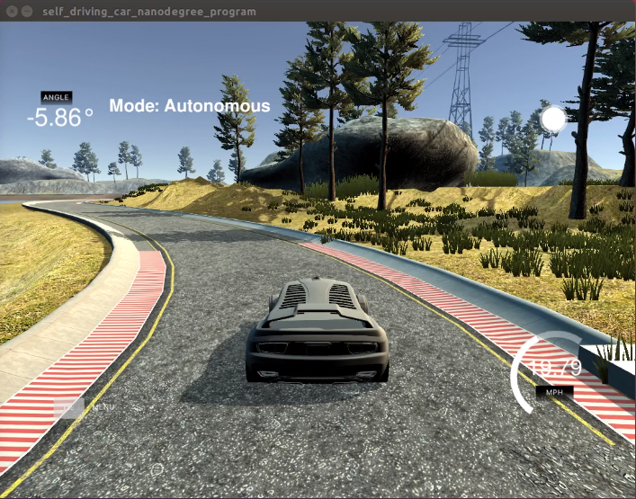
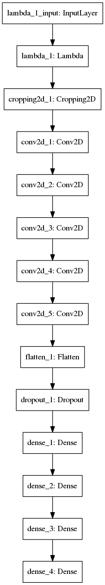
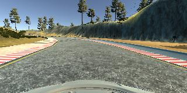
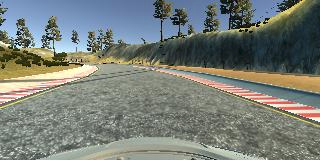
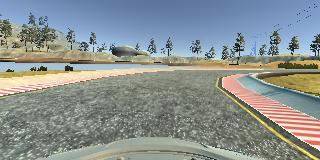
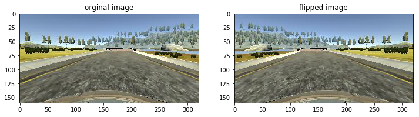
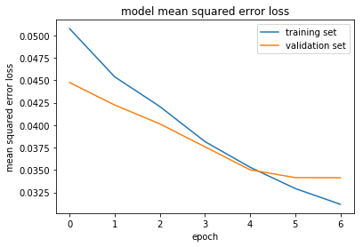

# **Behavioral Cloning** 
## Writeup file



---

**Behavioral Cloning Project**

The goals / steps of this project are the following:
* Use the simulator to collect data of good driving behavior
* Build, a convolution neural network in Keras that predicts steering angles from images
* Train and validate the model with a training and validation set
* Test that the model successfully drives around track one without leaving the road
* Summarize the results with a written report

---
### Files Submitted & Code Quality

#### 1. Submission includes all required files and can be used to run the simulator in autonomous mode

My project includes the following files:
* model2.py containing the script to create and train the model(fine tuned model)
* drive.py for driving the car in autonomous mode
* video.py for recording video
* model2.h5 containing a improved trained convolution neural network(referred to Nvidia End to End Learning for Self-Driving     Cars paper)
* run1.mp4 is record of vehicle driving autonomously around the track
* writeup.md summarizing the project steps and results

#### 2. Submission includes functional code
1. Using the Udacity provided simulator to collect data, then store train data in "./track1" and "./track2" folder respectively.                
    the folder "./data" contains the data provided by Udacity which also can be used to train the model.
2. drive.py file, the car can be driven autonomously around the track by executing 
```sh
python drive.py model2.h5
```
   recording video in autonomous mode if the model fine tuned in the folder "./run1"
```sh
python drive.py model2.h5 run1
```

3. video.py file, used to create create the video recording when in autonomous mode.
   Creates a video based on images found in the run1 directory which name is run1.mp4
```sh
python video.py run1
```

#### 3. Submission code is usable and readable

The model2.py file contains the code for training and saving the convolution neural network. The file shows the pipeline I used for training and validating the model, and it contains comments to explain how the code works.
The model2.ipynb is jupyter notebook format file just same as the model2.py, it's convenient and user-friendly for some audience.

### Model Architecture and Training Strategy

#### 1. An appropriate model architecture has been employed

refer to Nvidia End to End Learning for Self-Driving Cars paper, my fine tuned model2 consists of 1 lambda layer, 1 cropping layer,5 convolutional neural network and 3 fully connected layers.Finally output 1 steering angles. 

model definition in file model2.py lines 80 to 104 


#### 2. Attempts to reduce overfitting in the model

The model contains cropping layer which trim the image(remove top 70 rows,bottom 25 rows,left 20 columns,right 20 columns) in order to reduce overfitting.

The model contains dropout layer in order to reduce overfitting (model2.py line 100). 

The model was trained and validated on different data sets(80% v.s. 20% total collected data, used train_generator and validation_generator to feed input with batch_size of 32) to ensure that the model was not overfitting (code line 109-111). The model was tested by running it through the simulator on autonomous mode and ensuring that the vehicle could stay on the track.

#### 3. Model parameter tuning

The model used an adam optimizer, so the learning rate was not tuned manually (model2.py line 108).

#### 4. Appropriate training data

Training data was chosen to keep the vehicle driving on the road. I used a combination of center lane driving, recovering from the left and right sides of the road. collect around 2 laps data, slow down in sharp turn.


### Model Architecture and Training Strategy

#### 1. Solution Design Approach

The overall strategy is to build deep neurual network(CNN) model with multi convolutional layers followed multi fully connected layers to extract features,finally output approriate steering angles to control car running along the road.

My first step was to use 2 convolutional layer(kernel_size 5x5, activation relu) which followed by maxpooling layer to  reduce feature map size. I followed 2 fully connected layers, finally add 1 output as steering angle.

In order to evaluate the model performance, I split my image and steering angle data into a training and validation set with 80% v.s. 20% portion. use mean squared error as loss function. I found that my first model both train set and validation set mse loss stop to decrease after 2nd epochs, keep the value around 0.167. This implied that the model was underfitting. the model structure layers and hidden nodes too small to learn enough features.

To combat the underfitting, I modified the structure in model2.py with reference of Nvidia End to End Learning for Self-Driving Cars paper.           

The network consists of total 11 layers, including a normalization layer, a cropping layer, 5 convolutional layers,1 dropout layer and 3 fully connected layers.

The first lambda layer performs image normalization. The normalizer is zero mean and standardized to (-0.5,0.5).  Performing normalization in the network allows the normalization
scheme to be changed with the network architecture and to be accelerated via GPU processing. 

The cropping layer trim image to remove non-related noise which can increase the model robust. for example, over the top of image is the sky, hills, water, trees. below the bottom is the image behind car which is not related to car's moving. for the same reason, the left and right side of image can be trimmed. how many pixels can be trimmed, it's the parameters to tuned.

The convolutional layers were designed to perform feature extraction and were chosen empirically
through a series of experiments that varied layer configurations. I use strided convolutions in the
first three convolutional layers with a 2×2 stride and a 5×5 kernel and a non-strided convolution
with a 3×3 kernel size in the last two convolutional layers.

I flattened the last convolutional layers to 1D vector. I followed a dropout layer which is used to reduce overfitting. 

I followed the five convolutional layers with three fully connected layers leading to an output control
value.

Then I set the adam optimizer, batch_size, epochs to train the model. after 7 epochs iteration, mse loss converge. the final loss value depend on collected data and data augmentation.

The final step was to run the simulator to see how well the car was driving around track one. There were a few spots where the vehicle fell off the track. to improve the driving behavior in these cases, I add images from left and right side carmera. set the initial left and right angel correction value to 0.2, then found that 0.3 is appropriate. 

At the end of the process, the vehicle is able to drive autonomously around the track without leaving the road.

#### 2. Final Model Architecture

The final model architecture (model.py lines 18-24) consisted of a convolution neural network with the following layers and layer sizes ...

Here is a visualization of the architecture (note: visualizing the architecture is optional according to the project rubric)

    Layer (type)                 Output Shape              Param #   
=====================================================================

    lambda_1 (Lambda)            (None, 160, 320, 3)       0         
_________________________________________________________________
    cropping2d_1 (Cropping2D)    (None, 65, 280, 3)        0         
_________________________________________________________________
    conv2d_1 (Conv2D)            (None, 31, 138, 24)       1824      
_________________________________________________________________
    conv2d_2 (Conv2D)            (None, 14, 67, 36)        21636     
_________________________________________________________________
    conv2d_3 (Conv2D)            (None, 5, 32, 48)         43248     
_________________________________________________________________
    conv2d_4 (Conv2D)            (None, 3, 30, 64)         27712     
_________________________________________________________________
    conv2d_5 (Conv2D)            (None, 1, 28, 64)         36928     
_________________________________________________________________
    flatten_1 (Flatten)          (None, 1792)              0         
_________________________________________________________________
    dropout_1 (Dropout)          (None, 1792)              0         
_________________________________________________________________
    dense_1 (Dense)              (None, 100)               179300    
_________________________________________________________________
    dense_2 (Dense)              (None, 50)                5050      
_________________________________________________________________
    dense_3 (Dense)              (None, 10)                510       
_________________________________________________________________
    
    dense_4 (Dense)              (None, 1)                 11        
=====================================================================

    Total params: 316,219
    Trainable params: 316,219
    Non-trainable params: 0

model graph as below:



#### 3. Creation of the Training Set & Training Process

To capture good driving behavior, I recorded two laps on track one using center lane driving and recovering from the left side and right sides of the road back to center so that the vehicle would learn to turn at the sharp turn. Here is an example image of center lane driving:



These images show what a recovery looks like:





Then I repeated this process on track two in order to get more data points.

To augment the data sat, I also flipped images and angles thinking that this would ... For example, here is an image that has then been flipped:




After the collection process, I had 35,881 number of data points. I use center,left, right camera data and preprocessed this data by data augmentatin which add flipped image of each image. total number of dataset is 35,881 * 3 = 107,643.

I randomly shuffled the data set and put 20% of the data into a validation set. 

I use train_generator and validation_generator to generate batch data for model training process. I adopt data augmentation which add flipped image. so the sample number of both train and validation set are doubled. 

I used this training set for training the model. The validation set helped evaluate if the model was over or under fitting. The ideal number of epochs was 7 as evidenced by mse loss curve. I used an adam optimizer so that manually training the learning rate wasn't necessary.


